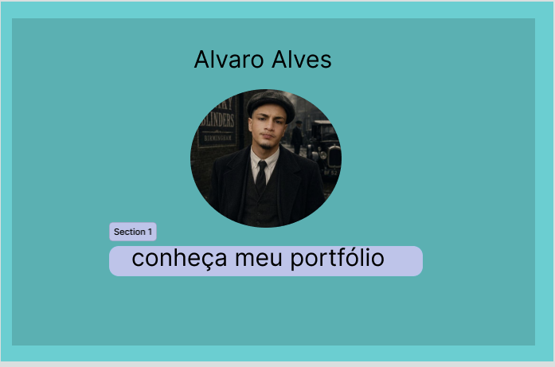
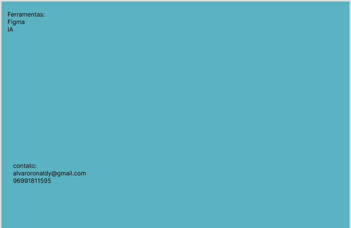

# Meu-portfólio
# Descrição
Este projeto apresenta o wireframe inicial do meu portfólio profissional,
desenvolvido utilizando a ferramenta Figma.

 # Ferramenta utilizada

 .figma
 
 .IA
 
 # Protótipo
 Link para o protótipo no Figma:https://www.figma.com/design/ZyE3BY5NBNdqbekEpG6uWm/Sem-t%C3%ADtulo?node-id=4-3&t=rg9qkspRwy8UuV8g-1

#Capturas de tela
# Tela 1

# Tela 2

 # Tela 3

 
 https://www.figma.com/design/ZyE3BY5NBNdqbekEpG6uWm/Sem-t%C3%ADtulo?node-id=0-1&p=f&t=tZwq0khHL0fVvMCf-0

Autor:
Álvaro Rônaldy santos Alves

-GitHub:https://github.com/Alvaroalves27/Meu-portfolio

-E-mail:alvaroronaldy@gmail.com
